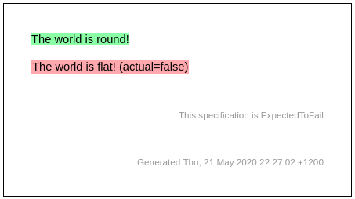

# assert-true command


## overview
The `?` command prefix is overloaded for assert-true and assert-equals.

If the expression evaluation results in a bool then assert-true is applied. 

The example below also shows usage of the ExpectedToFail directive which
exempts further failures from causing the test to fail.

```markdown
[The world is round!](- "?IsTheWorldRound()")

[ ](- "!ExpectedToFail")

[The world is flat!](- "?IsTheWorldFlat()")
```


Here is the corresponding fixture:

```go
func TestAssertTrue(t *testing.T) {
	conthego.RunSpec(t, &AssertTrueFixture{})
}

type AssertTrueFixture struct {
}

func (f *AssertTrueFixture) IsTheWorldRound() bool {
	return true
}

func (f *AssertTrueFixture) IsTheWorldFlat() bool {
	return false
}
```

When run, the output specification will show:




## examples

[The world is round!](- "?IsTheWorldRound()")

[ ](- "!ExpectedToFail")

[The world is flat!](- "?IsTheWorldFlat()")

