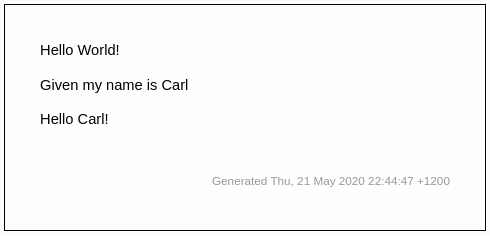

# set and echo

## overview

The echo command gets invoked by the `$` command prefix.

The spec below demonstrates:
 
* echoing the value of a method result
* setting a variable `name` from spec text
* storing the method result in a variable
* echoing the value of a stored variable

```markdown
[ ](- "$GetGreeting()")

Given my name is [Carl](- "name")

[ ](- "greeting=GetPersonalisedGreeting(name)")

[ ](- "$greeting")
```


Here is the corresponding fixture:

```go
func TestEcho(t *testing.T) {
	conthego.RunSpec(t, &SetAndEchoFixture{})
}

type SetAndEchoFixture struct {
}

func (f *SetAndEchoFixture) GetGreeting() string {
	return "Hello World!"
}

func (f *SetAndEchoFixture) GetPersonalisedGreeting(name string) string {
	return "Hello " + name + "!"
}
```

When run, the output specification will show:




## examples

[ ](- "$GetGreeting()")

Given my name is [Carl](- "name")

[ ](- "greeting=GetPersonalisedGreeting(name)")

[ ](- "$greeting")
